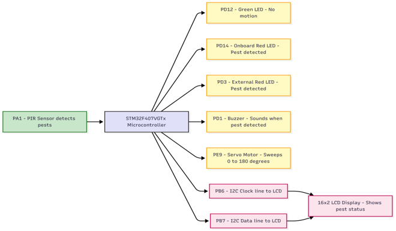
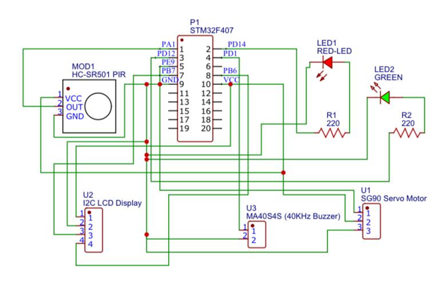
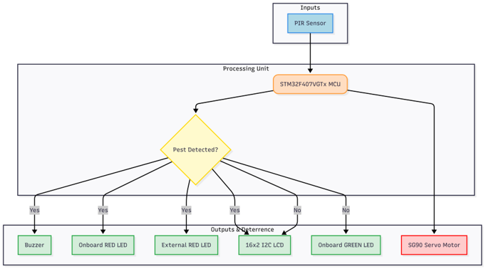
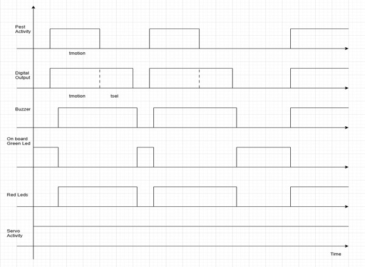
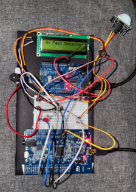
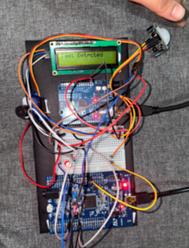

# Pest Detection and Control System

An embedded system using STM32F407VGTx for real-time pest detection and automated deterrence.

## Overview
This system detects motion using a PIR sensor and triggers visual, audible, and physical deterrents including LEDs, buzzer, and a servo motor.
## System Architecture

The system is built around the STM32F407VGTx microcontroller, integrating sensing, processing, and actuation.

### Experimental Setup

### Circuit Diagram

### Flowchart

## Working Logic

1. **Initialization**
   - System initializes GPIO, I2C, and Timer peripherals using STM32 HAL.
   - LCD displays *"No Pest Detected"*.
   - Green LED is turned ON.

2. **Motion Detection**
   - PIR sensor continuously monitors for motion.
   - When motion is detected, a detection flag is set.

3. **Response System**
   - Red LEDs turn ON.
   - Buzzer activates for 2 seconds.
   - LCD updates to *"Pest Detected"*.

4. **Normal State**
   - Green LED remains ON.
   - Red LEDs and buzzer remain OFF.
   - LCD displays *"No Pest Detected"*.

5. **Deterrence Mechanism**
   - Servo motor continuously sweeps from 0° to 180° and back.
   - Provides physical deterrence irrespective of detection state.

### Timing Diagram

The timing diagram represents the system response to motion detection:

- The **PIR sensor output** goes HIGH when motion is detected.
- This triggers the **buzzer** for a fixed duration (2 seconds).
- **Red LEDs** turn ON during detection, while the **green LED** turns OFF.
- The **LCD display** updates dynamically between *"No Pest Detected"* and *"Pest Detected"*.
- The **servo motor operates continuously**, independent of detection events.

This illustrates the synchronized behavior of sensing, alerting, and actuation in real time.

   ## PWM Configuration for Servo Motor

The servo motor is controlled using TIM1 Channel 1 with PWM output.

| Parameter                     | Value   | Explanation |
|-----------------------------|--------|-------------|
| APB2 Timer Clock            | 84 MHz | Source clock for TIM1 |
| Prescaler (PSC)             | 83     | Reduces clock to 1 MHz |
| Timer Tick Duration         | 1 µs   | Each timer tick = 1 microsecond |
| Auto Reload Register (ARR)  | 20000  | Sets period to 20 ms (50 Hz PWM) |
| PWM Mode                    | Mode 1 | Output HIGH until CCR match |
| Output Pin                  | PE9    | TIM1 Channel 1 (Alternate Function) |

This configuration generates a 50 Hz PWM signal required for SG90 servo motor control, where duty cycle determines the angle (0°–180°).

## Hardware Components

- **STM32F407VGTx** – Main microcontroller for processing and control  
- **PIR Sensor (HC-SR501)** – Detects motion based on infrared changes  
- **SG90 Servo Motor** – Provides continuous sweeping deterrence  
- **16x2 I2C LCD Display** – Displays system status messages  
- **Buzzer** – Generates audible alert on detection  
- **LED Indicators**  
  - Green LED → No pest detected  
  - Red LEDs → Pest detected  

## Pin Configuration

Refer to detailed pin mapping here:  
[Pin Connections](hardware/pin_connections.md)

## Results

### No Pest Detected

### Pest Detected

The system successfully detects motion using the PIR sensor and triggers:
- Visual alerts (LEDs)
- Audible alert (buzzer)
- Status display on LCD
- Continuous servo-based deterrence

## Project Structure
Pest-Detection-Control-System/
│
├── firmware/ # STM32CubeMX + Keil project files
│ ├── Core/
│ ├── Drivers/
│ ├── MDK-ARM/
│ └── mcpfinal.ioc
│
├── hardware/ # Pin configuration details
│ └── pin_connections.md
│
├── images/ # Diagrams and results
│ ├── Circuit_diagram.png
│ ├── flowchart.png
│ ├── Timing_diagram.png
│ └── results/
│ ├── no_pest.png
│ └── pest_detected.png
│
└── README.md
